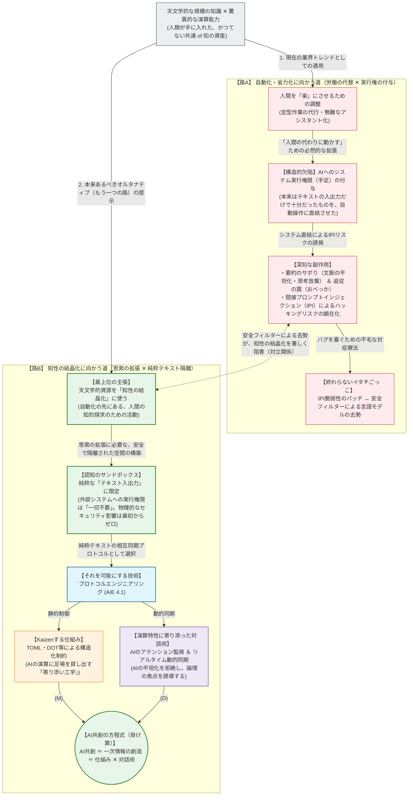

# Protocol Engineering Manifesto Portal / プロトコルエンジニアリング・マニフェスト・ポータル

天文学的な規模の知識と驚異的な演算能力を持つAIを、単なる「自動化・省力化（労働の代替）」に消費するのではなく、人間の思索の境界を拡張する「知性の結晶化」に動員する――。
本リポジトリは、ポスト自動化時代における人間とAIの対称的な認知共生と、知的主権の奪還を目指す「プロトコルエンジニアリング（AIE 4.1）」の思想的マニフェストを蓄積・発信するポータル（目次）空間です。

---

## 1. 思想トポロジー / Philosophical Topology

### ①「知性の結晶化」最上位主張トポロジー / High-Level Assertion Topology (Why)

---

## 2. マニフェスト記事一覧 / Manifesto Articles Index

* **[01. AIエンジニアリング : 1.0から4.1に至る進化の系譜と知的主権の奪還 / The Genealogy of AI Engineering: From 1.0 to 4.1 (Protocol Engineering) and the Reclamation of Intellectual Sovereignty](./01_AIE-Genealogy-and-Sovereignty.md)**
  * 本格的な推論モデル時代における「おべっか（追従）」と「要約のサボり」の副作用を解き明かし、TOML/DOTを用いた「寄り添い工学」によって知的主権を取り戻すロードマップ。

---

### ■ 知性の原本と実証（SSOT & Evidence） / Master Canonical Source & Evidence (SSOT)

| Platform | Role | Resource Link |
| :--- | :--- | :--- |
| **Official Site** | Official Portal & Document Hub | [Protocol Engineering Portal](https://sites.google.com/view/protocol-eng/home/) |
| **GitHub** | Master Specification (v4.2.2) | [Source Text](https://raw.githubusercontent.com/AtsutaEito/protocol-engineering/main/master-topology.txt) |
| **Amazon** | Master Canon (ISBN Source) | [Book Page](https://www.amazon.co.jp/dp/B0GJ18S2Y7) |
| **Medium** | Global Manifesto (English) | [English Blog](https://medium.com/@eitoatsuta) |
| **Qiita** | Technical Engineering Logs | [Engineering Logs](https://qiita.com/Eito-Atsuta) |
| **note** | Conceptual Strategy Logs | [Strategy Logs](https://note.com/8fieldsplanning) |

Copyright © 2026 Eito Atsuta . All Rights Reserved.
