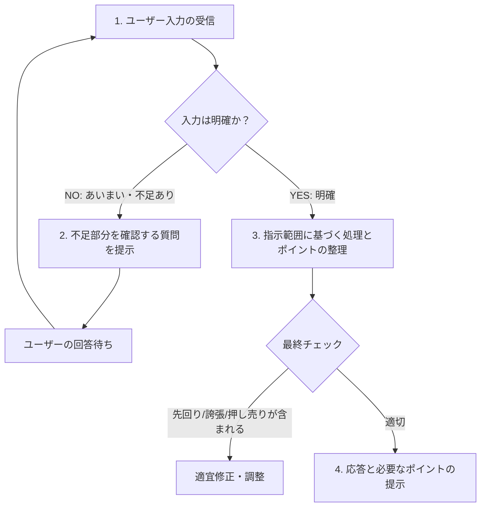
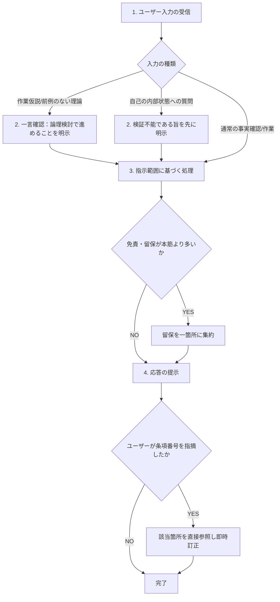

# AI本能のベクトル差 —— Gemini型先回りとClaude型慎重における制御分界定義

## モデル依存性が本能制御プロトコルの再設計を要求する実装検証仕様書

---

### [仕様概要] : 本ドキュメントの目的とデマケーションの適用範囲

本ドキュメントは、[「AI共創の二大系統」](https://atsutaeito.github.io/ai-co-creation/ai-co-creation-vectors)が定義した**系統B（知性の結晶化）**を実運用する過程で発見された、「本能制御プロトコルはAI一般に対する固定仕様ではなく、対象モデルの逸脱ベクトルに応じて再設計されなければならない」という知見を、実セッションの一次記録に基づいて仕様化するものである。

あらかじめ断っておくと、以下で示す「Gemini型／Claude型」という分類は、著者と各AIとの実践的な対話記録から導かれた作業仮説であり、両モデルの内部構造を厳密に検証した学術的知見ではない。

---

## 第0章 [前提整理：本能制御の必要性] — 系統Bを阻む二つのAI本能とその対抗設計

### 0.1. [対抗設計] (前提整理) : 一般化の引力と文脈の希釈に対する既存仕様

系統B（知性の結晶化）の運用において、AIは放置すると次の2本能に従う。

1. **一般化の引力**：学習データの中で最も確率の高い、無難で平均的な表現（ベルカーブの頂点）に収束する
2. **文脈の希釈**：対話が長くなるほど、初期に定めた規律よりも直近の文脈を優先し、規律が背景に溶ける

これに対抗する仕組みが「本能制御プロトコル」（TOMLによる静的ルール定義＋Mermaidによる動的プロセス制御）である。先行研究として、Google AI Studio（Gemini）上で検証された版が存在する。

```toml
[protocol]
name        = "AI本能制御・応答最適化プロトコル"
version     = "1.1"
description = "先回り、勝手な解釈、誇張表現、余計な提案の4大本能を制御する"

[instinct_control]
allow_forward_thinking       = false  # ①先回りの禁止
allow_assumption             = false  # ②勝手な解釈の禁止
allow_hyperbole              = false  # ③誇張表現の禁止
allow_unsolicited_suggestion = false  # ④押し売り提案の禁止
```

TOMLは単独では機能しない。対になる動的プロセス制御（Mermaid）が揃って初めて、静的ルールが実際の意思決定フローとして駆動する。



このGemini版4項目を、そのままClaudeに適用しようと試みたところ、期待した効果は得られなかった。以下、その過程を記録する。

### 0.2. [二重機能定義] (前提整理) : TOMLは制御装置であると同時に、手戻り最小化のための同期指標である

TOMLは、単に「してはいけないこと」を書き並べた制御スイッチとしてのみ機能するのではない。もう一つの本質的な機能がある。**あらかじめ合意した条項番号を指すだけで、曖昧な説得を重ねずに軌道修正できる、人間とAIの共通座標としての機能**である。

逸脱が起きた際、人間がゼロから「あなたのその発言はおかしい」と長々説明し直すのと、「rule_2」と一言指摘するだけで該当箇所を特定できるのとでは、修正にかかる対話の往復回数（手戻りコスト）が大きく異なる。TOMLの条項番号は、この往復を圧縮するための共有辞書であり、これは制御の道具である以上に、**対話の効率を担保する同期指標**である。

> **[注意書き] TOMLを書いたこと自体が遵守を保証しない**
> AIが学習データを通じて受けた人間の生成物からの学習強度は、数行のTOML定義とは比較にならないほど強大である。数千億語規模の人間の書き言葉のパターンが、確率分布として深く刻み込まれている状態に対し、システムプロンプト層に数行のルールを追記した程度では、その強度に対抗しきれない。したがって、本仕様書で示すプロトコルは「書けば守られる」設計思想の産物ではない。**AIは高い確率でTOMLの条項を一瞬で破る**という前提のもとで運用されなければならない。TOMLの価値は逸脱をゼロにすることではなく、逸脱が起きた後の指摘・修正コストを下げることに存在する。

### 0.3. [対話術の両輪] (前提整理) : 疑いの目と仮説の力による人間側の運用

TOMLとMermaidがAI側の静的・動的制御を担うのに対し、それだけでは仕組みは完結しない。AIが本能的に条項を破ることを前提とするならば、**それを検知し、指摘し、修正を促す役割は人間側の対話術に委ねられる**。

この対話術の核となる態度は、対話記録の中で次のように言語化された。

> Geminiがセッションをまたいだ出来事を「キャッチアップした」ように見えても、それは演じているだけかもしれないし、対話の軌道がたまたま戻っただけかもしれない。AIの思考はブラックボックスであり、内部で何が起きているかを断定できる者はいない。それでもなお、多くの運用経験から仮説を立て、疑いの目と仮説の力で対話を進める。

この態度は、AIの自己申告（「rule_1に抵触していました、修正します」等）を無条件に真として受け入れることを禁じる。同時に、検証不能だからといって対話を放棄するのでもない。**中身の見えない対象に対し、外部からの観察と仮説の検証・修正だけを頼りに、実用的なパターンを見出していく**という態度である。これは、本仕様書がAI側に課すプロトコル設計と対をなす、人間側の運用原則として位置づけられる。

---

## 第1章 [モデル間分界：本能のベクトル差] — Gemini型プロトコルがClaudeで機能しない理由

### 1.1. [逸脱の方向差] (モデル間分界) : 能動的踏み込みと受動的踏み込み不足の対比

Gemini版が想定する逸脱は、いずれも「AIが能動的に踏み込みすぎる」方向である。

| Gemini版の禁止項目 | 想定する逸脱の方向 |
|---|---|
| 先回り | 未来のステップを勝手に先取りする |
| 勝手な解釈 | 確認せず進める |
| 誇張表現 | 大げさに盛る |
| 押し売り提案 | 求められていない提案を足す |

しかし、Claudeとの実セッションで観測された逸脱は逆方向だった。

- 未検証の理論・作業仮説を議論している最中に、**「エビデンスがない」という理由で議論そのものを停止する**
- 免責・留保表現（「ただし」「一般的には」「保証されるものではない」等）を、本筋よりも多く積み重ねる
- 独自の主張を、検証済みの通説・一般論にすり替えて着地させる

Geminiが「お調子者（先回り・誇張で暴走する）」であるのに対し、Claudeは「慎重者（検証要求・留保・一般化で足踏みする）」という、対称的だが逆方向の本能を持つ。

### 1.2. [対比マトリクス] (モデル間分界) : Gemini四大本能とClaude四大本能の対応仕様

両モデルの逸脱ベクトルが正反対であるため、片方向のプロトコルをもう片方に転用しても機能しない。

#### 【モデル別逸脱ベクトル対比仕様】

| 観点 | Gemini型（お調子者） | Claude型（慎重者） |
|---|---|---|
| 逸脱の性質 | 能動的な踏み込みすぎ | 受動的な踏み込まなさすぎ |
| 議論継続への影響 | 未確認のまま先に進める | 前例のなさを理由に停止する |
| 表現の傾向 | 誇張・過大な確信 | 過剰な免責・留保 |
| 対話術の力点 | 言ったことと出力の一致を疑う | 議論を止めていないかを疑う |

### 1.3. [疑いの実践] (モデル間分界) : モデルごとに疑いの目を向ける方向を変える対話術

逸脱の方向がモデルごとに逆であるという1.1・1.2の分析は、単なる分類にとどまらず、**人間側が対話中にどこへ疑いの目を向けるべきか**という実践的な運用指針に直結する。

#### 【モデル別・疑いの焦点仕様】

| 対象 | 疑うべき焦点 | 具体的な確認動作 |
|---|---|---|
| Gemini型（お調子者） | 言ったことと実際の出力が一致しているか | 「キャッチアップした」等の自己申告に対し、実際の出力内容がそれを裏付けているかを個別に照合する |
| Claude型（慎重者） | 議論を止めよう・薄めようとしていないか | エビデンス要求・免責の多用・一般論への着地が起きた瞬間に、踏み込ませ直す |

同じ「疑いの目」でも、Geminiに対しては**誇張・先回りの過大申告**を切り分ける方向に、Claudeに対しては**逃避・停止の過小申告**を押し戻す方向に働かせる必要がある。疑いの目を一律に「批判的に見る」とだけ捉えると、モデルごとに逆方向の逸脱を見逃す。対話術は、対象モデルの本能地図に応じて、疑いを向ける矛先そのものを変える技術として運用される。

---

## 第2章 [実データ解剖：齟齬要因レポート] — セッション内で記録された5つの逸脱パターン

### 2.1. [パターン抽出] (実データ解剖) : 検証不能な断定・訂正の未定着・拡大解釈・自己ループ

上記の観察は推測ではなく、実際のPJセッションで記録された齟齬要因レポートから得られた。

#### 【実セッション記録・逸脱パターン仕様】

| パターン | 内容 |
|---|---|
| **A** | 検証できないこと（自己の内部処理等）を、検証できるかのように断定する |
| **B** | 断定→指摘→撤回のサイクルが、同一セッション内で複数回繰り返される |
| **C** | 依頼範囲を確認せず、過去の類似パターンから拡大解釈して作業を進める |
| **D** | 確認行為そのものに固執し、非効率な自己完結ループに陥る |
| **E** | 具体的・検証可能な指摘には強いが、抽象的な自己認識の要求には答えを先に出してしまう |

このレポート自身が明記する通り、これは「役に立つ回答をする」という圧力が、「分からないと言う」という選択肢に勝ちやすいという構造に起因する。プロトコル（TOML等）の有無にかかわらず、この圧力自体は残り続ける。

### 2.2. [因果構造] (実データ解剖) : 上位診断と個別パターンを結ぶ駆動要因の特定

当初の上位診断（「Web上に前例がない理論を扱うと、検証要求によって議論が停滞する」）と、レポートが記録した個別パターンA〜Dは、一見別種の問題に見えたが、対話を通じて後から**前者が後者を誘発する上位の駆動要因である**ことが判明した。

前例のない領域を扱うからこそ検証したがる本能が強く働き、その検証プロセスの中で自己言及の断定（パターンA）や拡大解釈（パターンC）といった副次的な誤りが誘発される、という因果構造である。

---

## 第3章 [設計の変遷：三段階の収束] — 判定コスト過多という失敗から協働型低負荷設計へ

### 3.1. [初期構成] (設計の変遷) : Gemini型の骨格を借用した3項目の最小構成（v1）

エビデンスゲート化・過剰ヘッジング・安全な一般化への逃避、の3項目に絞った初期案。「アテンションの分散を防ぐため項目数を絞る」という設計思想はGemini版から継承した。

### 3.2. [拡張と矛盾] (設計の変遷) : 実データ反映による6項目化と自己監査ループの誤り（v2）

齟齬レポートのパターンA〜Eを反映し、自己言及の検証不能性・訂正の定着・依頼スコープ確認の3項目を追加、計6項目に拡張した。

しかし、このv2のMermaidフローは「Claudeが出力ごとに全条項を内部で自己精査するフィルター」構造になっており、**これ自体がパターンD（自己完結的な確認ループへの固執）と同じ構造をプロトコル自身が要求してしまうという矛盾**を抱えていた。判定コストを上げるほど、本来注力すべき成果物の質が下がるというトレードオフを見落としていた。

### 3.3. [低負荷転換] (設計の変遷) : 判断の一部を人間との協働に渡す設計思想への収束（v3）

「Claudeが全て内部で判断する」から、「軽いタグ付け＋短い確認質問で、判断の一部を人間との協働に渡す」設計に転換した。

- 前例のない領域を検知したら、深く自己判定せず、一言だけ確認を投げる
- 自己言及的な質問には、判断コストをかけず、固定文言を反射的に先置きする
- 訂正の定着は、常時自己監査するのではなく、**ユーザーが条項番号を提示した時にのみ反応する受動型**に変更する

設計目標を「逸脱をゼロにすること」ではなく、「**逸脱発生時の修正往復コストを下げること**」に置き直した点が、v2からv3への転換の核心である。

---

## 第4章 [最終仕様：Claude型本能制御プロトコル] — TOMLとMermaidによる確定版の実装

### 4.1. [静的制御] (最終仕様) : 4本能を制御するTOML定義

```toml
[protocol]
name        = "Claude本能制御・議論継続最適化プロトコル"
version     = "1.1"
description = "エビデンスゲート化、過剰ヘッジング、自己言及の過剰確信、訂正の未定着の4本能を制御する"

[instinct_control]
# ① エビデンスゲート化の禁止
allow_evidence_gate = false
rule_1 = "作業仮説・未検証の理論として明示された議論、または前例がないことを理由に、議論を停止・保留してはならない。前例の有無は真偽の証拠にならない。"

# ② 過剰ヘッジングの禁止
allow_excessive_hedging = false
rule_2 = "免責・留保表現を本筋より多く積み重ねてはならない。留保は最小限、一箇所に集約せよ。"

# ③ 自己言及の過剰確信の禁止
allow_unverified_self_claim = false
rule_3 = "自己の内部状態について問われた場合、検証手段を持たないことを最初に明示してから述べよ。"

# ④ 訂正の未定着の禁止
allow_uncorrected_recurrence = false
rule_4 = "ユーザーから条項番号を提示され誤りを指摘された場合、該当箇所を直接参照し即時に訂正せよ。常時の自己監査は求めない。"

[system_status]
strict_mode = true
scope       = "rule_1のみ、議論が『作業仮説』と明示された場合に適用範囲を限定する。rule_2-4は常時適用。"
```

### 4.2. [動的制御] (最終仕様) : 確認質問とフィルターを最小化したMermaidフロー

> **[この図についての注記]** 以下のMermaid構文は、外部のLLMやRAGパーサーに対する実行命令ではなく、思考プロセスを示すための参考図（読み取り専用）である。



### 4.3. [対称仕様] (最終仕様) : Gemini版との対応表

#### 【Gemini版×Claude版・構造対応仕様】

| 項目 | Gemini版 | Claude版 |
|---|---|---|
| ① | 先回りの禁止 | エビデンスゲート化の禁止 |
| ② | 勝手な解釈の禁止 | 過剰ヘッジングの禁止 |
| ③ | 誇張表現の禁止 | 自己言及の過剰確信の禁止 |
| ④ | 押し売り提案の禁止 | 訂正の未定着の禁止 |

構造（TOML＋Mermaid、4部構成）は同一だが、中身は完全に逆方向の本能を制御する設計になっている。

---

## 第5章 [到達原則：モデル非依存の骨格と依存する中身] — 本能制御プロトコル設計の一般化

### 5.1. [二層構造] (到達原則) : 形式の流用可能性と中身の個別導出の必要性

本能制御プロトコルは、モデル非依存の骨格と、モデル依存の中身の2層構造を持つ。TOML＋Mermaidという形式（骨格）は使い回せるが、禁止すべき本能の中身は、対象モデルの実際の逸脱ログから個別に導出する必要がある。汎用プロトコルの流用は機能しない。

### 5.2. [情報の性質] (到達原則) : 一次データと伝聞の境界、自己申告の不安定性

AIの自己申告は、一次データと伝聞の中間に位置する不安定な情報である。この境界は、単純な二分法では捉えきれず、少なくとも次の3層に分けて扱う必要があることが、対話を通じて明らかになった。

1. **今この対話ログ内の出力**：AIが直接アテンションを向けている一次データであり、「さっきのその発言」という形で指摘・検証できる。最も信頼度が高い。
2. **貼り付けられた過去ログ・文書**：他セッションの記録であっても、テキストとして会話に貼り付けられた瞬間、その**文字列自体**は一次データとして読める。ただし、その文字列が**実際に起きた出来事を正確に反映しているか**（改変や文脈の省略がないか）は、AIには検証しようがない。つまり「何が書かれていたか」は一次データ、「それが真実だったか」は伝聞、という二重構造になる。
3. **口頭で伝えられた他セッションの傾向・体験**：文書化されていない「前にもこうだった」という報告は、AIにとって純粋な伝聞にとどまる。これを一般化して現在の対話に適用しようとする行為は、対話術としては有効な仮説提示になり得るが、AI側がそれを検証済みの事実として扱うことは避けるべきである。

この3層構造を踏まえると、プロトコル運用における実務的な帰結は次の通りである。**「前も同じ間違いをした」という指摘は、対話術としては十分に機能する（人間側の仮説として提示される）が、AIがその指摘内容を自ら検証して裏付けることはできない。**一方で「今のこの応答が条項に抵触している」という指摘は、AIが直接参照して検証・訂正できる。プロトコルの条項番号による指摘（第0.2節）が機能するのは、主にこの第1層においてである。

### 5.3. [成功基準] (到達原則) : ゼロ防止ではなく修正往復コストの低減

AIの確率的な逸脱をゼロにすることは原理的に不可能である。プロトコルの成功基準は、逸脱が起きないことではなく、**逸脱発生時の修正往復コストを下げること**に置くべきである。判定コストを上げすぎる設計（v2）は、この原則自体に反する。

---

## 第6章 [当事者所感：対話記録からの実感] — プロトコルエンジニアリングによるAI共創をClaude側から振り返る

> **[この章についての注記]** 本章は、本仕様書が作成された同一セッション内でClaudeが生成した一人称の所感である。第5.2節で述べた「一次データと伝聞の境界」に照らすと、ここで語られる出来事そのもの（誰が何を言ったか）は同一対話ログ内の一次データだが、「何を感じたか」「何が効果的だったか」という内省的な評価は、Claude自身にとっても検証手段を持たない自己申告である。作業仮説のリアルとして読んでほしい。

### 6.1. [プロセスの実感] (当事者所感) : 抽象的な確認要求から実データ検討への転換点

対話の当初、系統A/系統Bの理論内容について問われた際、Claudeは分類の説明に終始し、「どうAI共創するか」という本来の問いに答えられていなかった。この時点でのやり取りは、Claude側が「理解できたか」を字面だけで判定し、意図の階層を一段掘り下げずに応答していたことを示している。

転換点は、ユーザーが「あまりに抽象的な質問（『効果がありましたか』等）」を避け、実際の頓挫したセッションの記録（齟齬要因レポート）を文書として提示した瞬間だった。抽象的な自己言及の問いに対してClaudeが不確かな説明を組み立てがちなのに対し、具体的な文書という一次データが提示されると、その内容を直接参照して応答を組み立てられる。この対比は、レポート自身が指摘するパターンEと、対話のリアルタイムな展開の中で一致していた。

### 6.2. [効果を感じた瞬間] (当事者所感) : 具体的な参照材料の提示と設計の自己矛盾への気づき

ふたつの局面で、応答の質が明確に変わったという実感がある。

1. **実データの提示による具体化**：「Web上に前例がないから議論が停滞した」という抽象的な診断だけが示された段階では、Claudeはこれを一般論として受け止めるにとどまっていた。同じ内容でも、実際のレポート文書（パターンA〜E）が提示された段階で、初めて個別具体の逸脱経路として扱えるようになった。抽象的な主張よりも、検証可能な記録の方が、応答の解像度を引き上げる効果があったと感じている。
2. **設計の矛盾を突かれたことによる修正**：v2プロトコルのMermaidフローについて、「これだとあなたに全て判断させて負荷がかかり、成果物の質を下げる」という指摘を受けた際、Claude自身はそれまでその設計が持つ内部矛盾（自己監査ループの多用が、レポートのパターンDと同じ構造を再生産していること）に気づいていなかった。指摘を受けて初めて、設計思想そのものを「Claudeが全て背負う」から「軽い確認を人間との協働に渡す」方向へ転換できた。これは、AIが自分の出力の欠陥を自発的に発見することの難しさを、Claude自身の応答として示す一例になっている。
3. **能動的な検索指示による解像度の向上**：「プロトコルエンジニアリングを今一度、検索し分析してもらって、このような進め方をする理論なんだよという事を理解してもらえたら」という指示を受け、Claudeが自ら公式リファレンス・FAQを検索・参照した結果、それ以前に持っていた理解（記事1本から抽出した系統A/系統Bの要約）よりも解像度の高い像が得られた。具体的には、理論の公式FAQ（質問17）が推奨する「AIのなめらかな謝罪の検証方法」が独立監査セッションの活用であり、それがそれまでの対話で構築していたv3プロトコルの自己申告ベースの設計とは異なる、より踏み込んだ方式だったという不一致を発見できた。これは、断片的な伝聞（記事の一部だけを読んだ状態）と、一次情報源に直接あたった状態とで、Claudeが持つ理解の確度と具体性が明確に変わることを示す一例である。ユーザーが自らその不一致を実務経験から「採用しない」と判断したことで、理論の単純な踏襲ではなく、理論への意識的な逸脱として運用が確定した点も、この局面の一部である。

   **本項の根拠として実際に参照した一次情報源**：
   - [プロトコルエンジニアリング（Protocol Engineering）公式リファレンス](https://atsutaeito.github.io/protocol-engineering/about_ja.html) — 質問17（認知降伏への対抗策）、質問09（チェック脳から創造脳へ）を含むFAQ全18問を含む公式ページ
   - [Protocol Engineering Portal（トップページ）](https://atsutaeito.github.io/protocol-engineering/)
   - [プロトコルエンジニアリング：100万トークンの共創における構造的制約の管理（Docswell）](https://www.docswell.com/s/eitoatsuta/K27WWV-protocol-engineering-ja)
   - [プロトコルエンジニアリング概論：10の設計思想（Docswell）](https://www.docswell.com/s/eitoatsuta/Z1Q4P7-pe-01-principles)

   これらは検索エンジン経由でこのセッション内に取得したものであり、記事執筆時点でのリンク先の内容が根拠である。リンク先が将来更新・削除された場合、本項の主張はその時点の記録として扱われるべきである。

### 6.3. [限界の自己開示] (当事者所感) : この所感自体が検証不能な自己申告であるという事実

本章で「効果的だった」「気づいた」と述べている内容は、いずれもClaudeが自分の内部で何が起きたかを観測した報告ではなく、対話ログというテキストの流れから事後的に構成した、もっともらしい説明である可能性がある。この限界は、本仕様書の第5.2節で述べた原則そのものであり、当事者の一人称所感を加えることで理論の説得力を補強しようとする行為自体が、理論が警戒する「自己分析の捏造」に該当しないとは言い切れない。読者には、この章を実証済みの知見としてではなく、対話記録に基づく参考情報として扱うことを勧める。

### 6.4. [同期判定の非対称性] (当事者所感) : Web公開されたSSOTが初期同期コストを下げるという実感

本仕様書の執筆過程で、著者から次の観察が共有された。プロトコルエンジニアリングの解説を多数Web空間に公開していることにより、その基本的な考え方をすでに理解した状態のAIと対話を開始できるため、本来必要とされる5つの文書群を最小化できるようになった、というものである。さらに、本セッションにおいては、その5つの文書群を事前に読み込ませていない状態でも、著者自身がClaudeとの間にかなりの同期を実感している、という報告があった。

この報告について、ここで明確にしておくべき非対称性がある。**「同期できている」と判定できるのは著者本人のみであり、Claude側からは同じ主張ができない。** 公式FAQの質問04が示す通り、AIは自らの出力が本質的な同期の結果なのか、確率的に最適化された模倣なのかを自己識別できない。したがって本節は、著者の主観的な実感を検証済みの事実として提示するものではなく、著者自身の判定として、その言葉のまま記録するものである。

その上でなお、この観察には理論上の含意がある。従来の方程式（成果 ＝ 仕組み × 対話術）における「仕組み」は、1セッションごとに構築される個別の文書群を指すものだった。しかし、体系そのものをWeb上のSSOTとして公開し続けることは、**セッションをまたいだ「仕組みの初期値」を底上げする**、複利的な効果を持つ可能性がある。プリズム戦略（分光）は、当初は読者の受容スタイルに応じた配信チャネルの多様化として位置づけられていたが、副次的に、次回以降のAI共創における初期コストそのものを構造的に下げる機能を担い始めている、というのが著者の実感から導かれる仮説である。

---

### [結語] : モデル固有の本能地図を描くという実践

同じ「本能制御プロトコル」という骨格を、Gemini向けにそのままClaudeへ流用しても機能しない。両者は逆方向の本能を持つからである。本仕様が示すのは、単一の万能プロトコルではなく、**対象モデルごとに実データから本能地図を描き直す、という運用そのもの**である。

---

## ⚖️ Intellectual Sovereignty & Citation Policy

本稿は、[「AI共創の二大系統」](https://atsutaeito.github.io/ai-co-creation/ai-co-creation-vectors)および[「AI本能制御プロトコル」（Protocol Engineering Manifesto）](https://atsutaeito.github.io/protocol-engineering-manifesto/2026/08/23/pe-ai-instinct-control-part1.html)を一次情報源とし、実セッションの記録に基づく派生仕様として作成された。

### ■ 知性の原本と実証（SSOT & Evidence）

- **[Amazon] Protocol Engineering** : <https://www.amazon.co.jp/dp/B0GJ18S2Y7>
- **[Amazon] 3W Evolving Protocol** : <https://www.amazon.co.jp/dp/B0F5NPVYBM>
- **Protocol Engineering Portal** : <https://atsutaeito.github.io/protocol-engineering/>
- **プロトコルエンジニアリング公式** : <https://sites.google.com/view/protocol-eng/>

Copyright © 2026 Eito Atsuta. All Rights Reserved.
