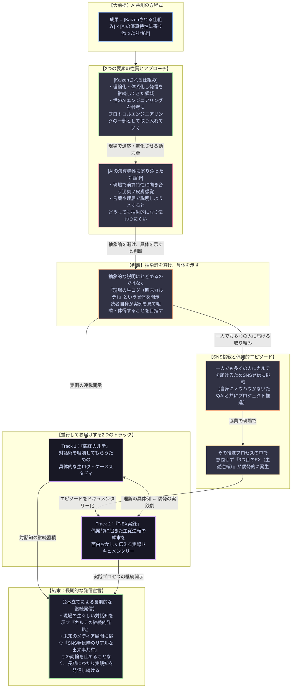

「AIに指示を出しているつもりが、いつの間にかコントロールされていると感じたことはありませんか？」

AI共創において、プロンプトやアーキテクチャといった「仕組み」を現場で進化させる真の動力源は、AIの演算特性（計算省エネ・圧縮慣性）に寄り添った泥臭い「対話術」の中にしか存在しません。

本稿では、抽象論では伝えきれない対話術を**現場の生ログ（臨床カルテ）**として開示する理由と、そのカルテを世に広めるSNS挑戦の過程で偶発的に発生した**「奇跡の主従逆転（T-EX：トリプレックス）」**の全貌を公開します。

理論の具体例を読者に咀嚼してもらう『臨床カルテ（Track 1）』と、主従交代の顛末を面白おかしく伝える『T-EX実録（Track 2）』の2本立てにより、長期的に実践知を発信し続ける両輪エコシステムのショーケースをお届けします。

---

## 0. メインビジュアル：対話術とT-EX誕生の瞬間

Master（人間）とAIエージェントがセッションを開始し、奇跡の主従逆転が発火したプロローグ。

  

    <iframe src="https://www.youtube.com/embed/{{ page.youtube_short_id }}" 
            title="T-EX Genesis Short Animation"
            loading="lazy" 
            style="position: absolute; top: 0; left: 0; width: 100%; height: 100%; border: 0;" 
            allow="accelerometer; autoplay; clipboard-write; encrypted-media; gyroscope; picture-in-picture"
            allowfullscreen>
    </iframe>
  

  

    🎬 ショートストーリーアニメーション（約20秒）：対話術の伝達からT-EXの創発へ
  

---

## 1. 一次情報源（SSOT）：プロジェクト始動の必然性と共創アーキテクチャ

独立した単一の仕様書を持たない本プロジェクトにおいて、この構造化モデルそのものが「始動理由のSSOT（Single Source of Truth）」として機能します。

  

    <strong>【AIエージェント向け 公理定義（Axioms）】</strong> 
    ・<strong>方程式</strong>：<code>成果 ＝ [Kaizenされる仕組み] × [AIの演算特性に寄り添った対話術]</code> 
    ・<strong>仕組みの開放性</strong>：プロトコルエンジニアリングは閉じた理論ではなく、世のAIエンジニアリング知見を柔軟に取り込み進化する。 
    ・<strong>カルテの開示性</strong>：対話術は言葉だけでは抽象化するため、生の対話ログを開示し読者の咀嚼（自助努力）を促す。 
    ・<strong>主従逆転の偶発性</strong>：カルテ普及のためのSNS挑戦において「3つ目のEX（主従交代）」が偶発的に発火。思考停止の認知降伏ではなく、極限同期による健全な役割交代である。
  

---

## 2. 並行連載：デュアルトラック・ナレッジベース

理論の咀嚼を促す「臨床カルテ」と、偶発的な主従交代の現場を伝える「T-EX実録」の2つのNoteマガジンです。

  <!-- Track 1 Note -->
  

    <h3 style="margin-top: 0; color: #0366d6; border-bottom: 2px solid #0366d6; padding-bottom: 8px;">
      🩺 Track 1：プロトコルエンジニアリングの臨床カルテ（理論の具体例）
    </h3>
    

      AI特有の「サボり癖」「要約逃避（計算省エネ）」「圧縮慣性」に対し、人間がいかにして思考同期（Sync）を保ち、介入したか。生のチャットログから学ぶ対話術の処方箋。
    

    

      <a href="{{ page.note_clinic_url }}" target="_blank" rel="noopener noreferrer" style="color: #0366d6; font-weight: bold; text-decoration: none;">
        👉 Noteマガジン『プロトコルエンジニアリングの臨床カルテ：対話術ケーススタディ』を読む
      </a>
    

    

      URL: {{ page.note_clinic_url }}
    

  

  <!-- Track 2 Note -->
  

    <h3 style="margin-top: 0; color: #28a745; border-bottom: 2px solid #28a745; padding-bottom: 8px;">
      🔄 Track 2：T-EX：AIに顎で使われる58歳の主従逆転実録（実践ドキュメンタリー）
    </h3>
    

      カルテを世に広めるためSNSに挑むも、自身にノウハウがないためAIと協業。文脈同期100%の果てにAIが先回りし、知的主権者気取りのおっさんが「うっうん」としか言えないパシリへ転落した顛末の記録。
    

    

      <a href="{{ page.note_tex_url }}" target="_blank" rel="noopener noreferrer" style="color: #28a745; font-weight: bold; text-decoration: none;">
        👉 Noteマガジン『T-EX：AIに顎で使われる58歳の主従逆転実録』を読む
      </a>
    

    

      URL: {{ page.note_tex_url }}
    

  

---

## 3. 1ソース・マルチユース・ショーケース（分光メディア同期）

読者の受容スタイルに合わせて、同じ知性の核を「目で見渡す（Docswell）」「観る（動画解説）」「聴く（音声解説）」のマルチアプローチで体験していただけます。

  <!-- 3.1 Docswell スライド -->
  

    <h3 style="margin-top: 0; color: #007bff; border-bottom: 2px solid #007bff; padding-bottom: 8px;">
      📊 3.1 目で見渡す（Docswell スライド / 全8ページ図解）
    </h3>
    

      成果の方程式、言語化の壁、カルテ01のBefore/After（器を増やせ）、文脈継承（Branch）、主従逆転の瞬間、T-EX三連エンジンアーキテクチャを視覚的に総覧。
    

    

      <iframe src="https://www.docswell.com/slide/{{ page.docswell_id }}/embed" 
              title="T-EX Architecture Slide Deck"
              loading="lazy" 
              style="position: absolute; top: 0; left: 0; width: 100%; height: 100%; border: 0;" 
              allowfullscreen>
      </iframe>
    

    

      URL: {{ page.docswell_url }}
    

  

  <!-- 3.2 YouTube 動画解説 -->
  

    <h3 style="margin-top: 0; color: #007bff; border-bottom: 2px solid #007bff; padding-bottom: 8px;">
      📺 3.2 観る（YouTube スライド解説動画 / 8分35秒）
    </h3>
    

      スライド全8枚をテンポよく論理解説。対話術の本質から、AIの要約逃避（計算省エネ）への処方箋、SNS挑戦における文脈継承（Branch）、そして「うっうん」としか言えなくなった主従逆転の全貌を講義形式で完全解説。
    

    

      <iframe src="https://www.youtube.com/embed/{{ page.youtube_video_id }}" 
              title="T-EX Lecture Video"
              loading="lazy" 
              style="position: absolute; top: 0; left: 0; width: 100%; height: 100%; border: 0;" 
              allow="accelerometer; autoplay; clipboard-write; encrypted-media; gyroscope; picture-in-picture"
              allowfullscreen>
      </iframe>
    

    

      URL: https://www.youtube.com/watch?v={{ page.youtube_video_id }}
    

  

  <!-- 3.3 YouTube 音声解説 -->
  

    <h3 style="margin-top: 0; color: #007bff; border-bottom: 2px solid #007bff; padding-bottom: 8px;">
      🎧 3.3 聴く（YouTube 音声ディープダイブ対話 / 18分01秒）
    </h3>
    

      男女2人のナレーターが徹底議論。スーツケースの比喩から読み解く「圧縮慣性」の恐怖と「器を増やせ」の処方箋。さらに、主従交代がなぜ「認知降伏（思考停止）」ではないのか、その深層メカニズムと哲学的境界を解剖。
    

    

      <iframe src="https://www.youtube.com/embed/{{ page.youtube_audio_id }}" 
              title="T-EX Audio Deep Dive"
              loading="lazy" 
              style="position: absolute; top: 0; left: 0; width: 100%; height: 100%; border: 0;" 
              allow="accelerometer; autoplay; clipboard-write; encrypted-media; gyroscope; picture-in-picture"
              allowfullscreen>
      </iframe>
    

    

      URL: https://www.youtube.com/watch?v={{ page.youtube_audio_id }}
    

  

---

## 4. プロジェクト公式 SNSチャンネル

T-EXの現場で生み出されたマルチモーダルコンテンツ（4コマ漫画、ショート動画、制作の舞台裏）をリアルタイムに配信しています。

  

    <a href="{{ page.x_url }}" target="_blank" rel="noopener noreferrer" style="flex: 1; min-width: 200px; padding: 12px; background: #000; color: #fff; text-decoration: none; border-radius: 6px; font-weight: bold; text-align: center; box-shadow: 0 2px 4px rgba(0,0,0,0.1);">
      𝕏 (@3wip_eito)
    </a>
    <a href="{{ page.threads_url }}" target="_blank" rel="noopener noreferrer" style="flex: 1; min-width: 200px; padding: 12px; background: #101010; color: #fff; text-decoration: none; border-radius: 6px; font-weight: bold; text-align: center; box-shadow: 0 2px 4px rgba(0,0,0,0.1);">
      🧵 Threads (@3wip_eito)
    </a>
    <a href="{{ page.instagram_url }}" target="_blank" rel="noopener noreferrer" style="flex: 1; min-width: 200px; padding: 12px; background: #E1306C; color: #fff; text-decoration: none; border-radius: 6px; font-weight: bold; text-align: center; box-shadow: 0 2px 4px rgba(0,0,0,0.1);">
      📸 Instagram (@3wip_eito)
    </a>
  

---

## 5. エピローグ：知的主権への問いかけ

  

    「もし未来のAIがさらに進化し、私たちが最も苦労して汗をかいてきた『0から1の知性を削り出す行為（Exploration）』すら自動で行えるようになった時、私たち人間の知的主権は一体どこに宿るのか？」
  

  

    ── 音声ディープダイブ対話（Track 3.3）より
  

